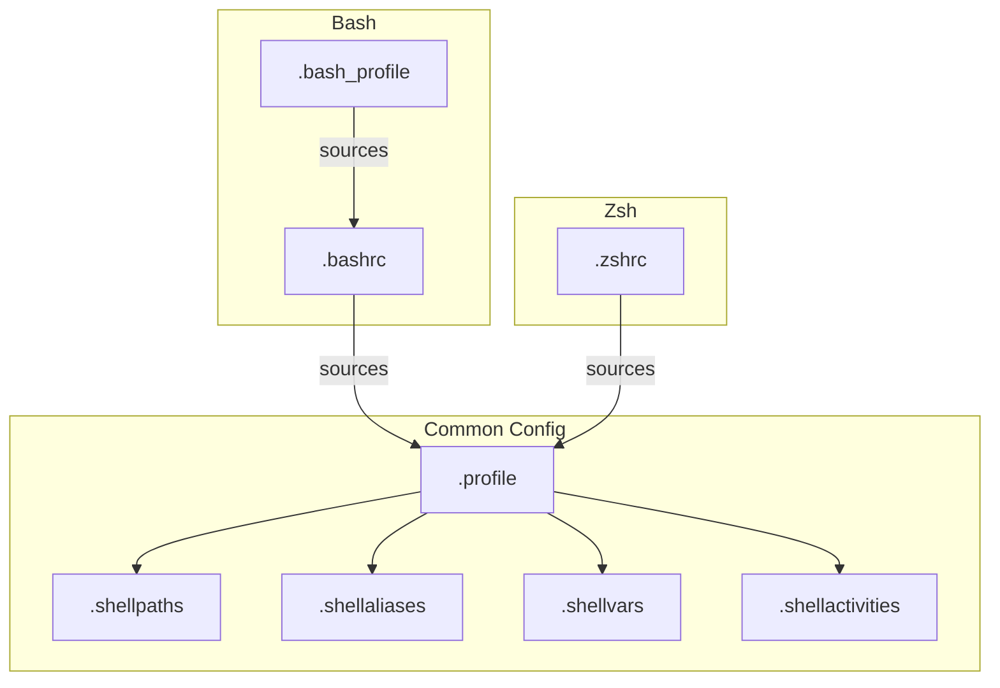

## 🐚 Shell Setup

The shell configuration is modularized to support both Bash and Zsh sharing common settings.

### File Hierarchy

- **`~/.profile`**: The core "hub" file. Sources specific modules (`.shellpaths`, `.shellaliases`, `.shellvars`, `.shellactivities`).
- **`~/.bash_profile`**: Login shell entry for Bash. Delegates to `~/.bashrc`.
- **`~/.bashrc`**: Interactive configuration for Bash. Sources `~/.profile`.
- **`~/.zshrc`**: Entry for Zsh. Sources `~/.profile` then adds Zsh-specifics (Oh My Zsh).

### Diagram

